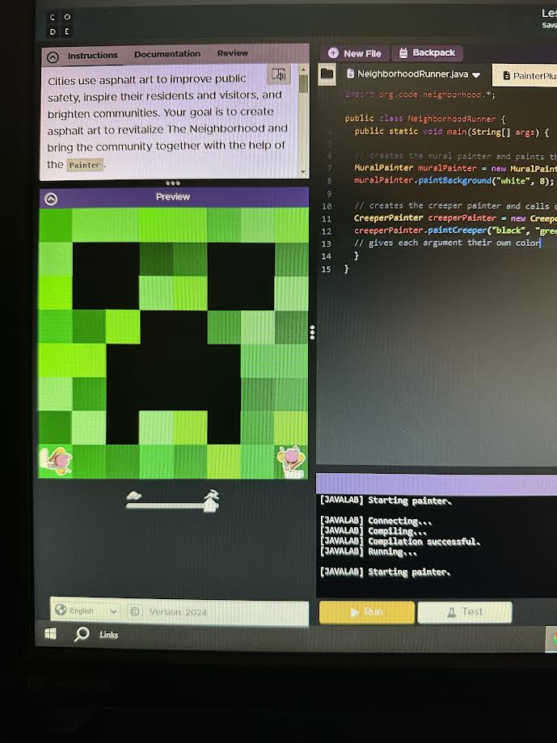

# Unit 1 - Asphalt Art

## Introduction

Cities use asphalt art to improve public safety, inspire their residents and visitors, and brighten communities. Your goal is to create asphalt art to revitalize The Neighborhood and bring the community together with the help of the Painter.

## Requirements

Use your knowledge of object-oriented programming, algorithms, the problem solving process, and decomposition strategies to create asphalt art:
- **Create a new subclass** – Create at least one new subclass of the PainterPlus class that is used for a component of the asphalt art design.
- **Plan an algorithm** – Use the problem solving process and decomposition strategies to plan an algorithm that incorporates a combination of sequencing, selection, and/or iteration.
- **Write a method** – Write at least one method in a PainterPlus subclass that contributes to a component of the asphalt art design.
- **Document your code** – Use comments to explain the purpose of the methods and code segments.

## Notes: Neighborhood & Painter Class

This project was created on Code.org's JavaLab platform using the built in Neightborhood GUI output. To test and edit this project you must build in Code.org's JavaLab with the Neighborhood GUI enabled. For reference to the Painter class documentation, [you can read more here.](https://studio.code.org/docs/ide/javalab/classes/Painter)

## Output:

## Reflection

1. Describe your project.

   - My project uses the neighborhood runner painters to create the design of a creeper head. (from minecraft)
   - The mural painter paints the entire background white to create a clean slate
   - The creeper painter paints the head of a creeper using six different colors

2. What are two things about your project that you are proud of?

    Two things about my project that I am proud of would be:
   - I wrote everything indiviudally and only used a creeper photo as reference
   - I kept my code organized and easy to change colors if needed

3. Describe something you would improve or do differently if you had an opportunity to change something about your project.

   - Something I would improve or do differently if I had an opportunity to change something about my project would be to make my code easier to read for someone that isn't as an experience coder. This is because the arguements for my methods are named without their actual colors.